# Project — How To Setup Prestashop Website On AWS

Prestashop (https://www.prestashop.com/en) is an Open Source Software.

Create a New Server Instance and Install PrestaShop on the Instance.

Your new Prestashop Installation should have a publicly accessible URL (use AWS default).

Important: Your Database should not be hosted on the same Server hosting your Application.

Important: Use only the Free-Tier of Amazon Web Services.


# STEP 1 — Create an Ec2 instance 

Follow below steps to setup an Ec2 instance

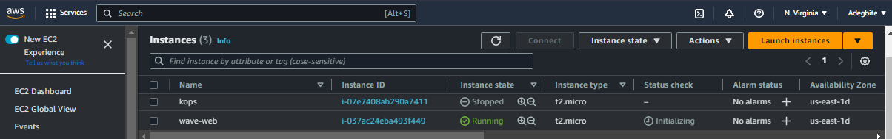

Create a keypair and security group to allow ssh into instance. Ec2 instance connect is another option

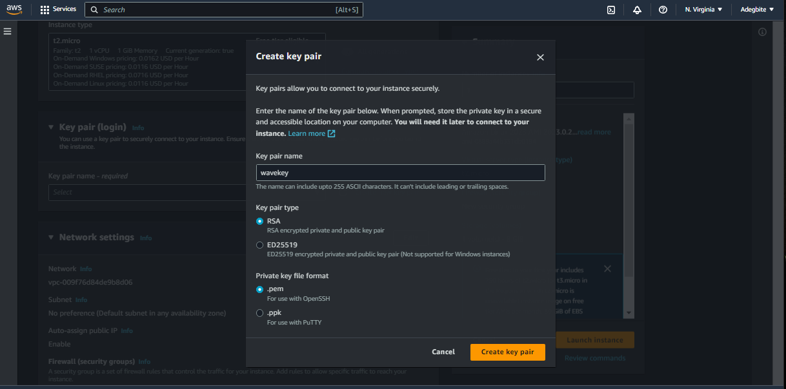

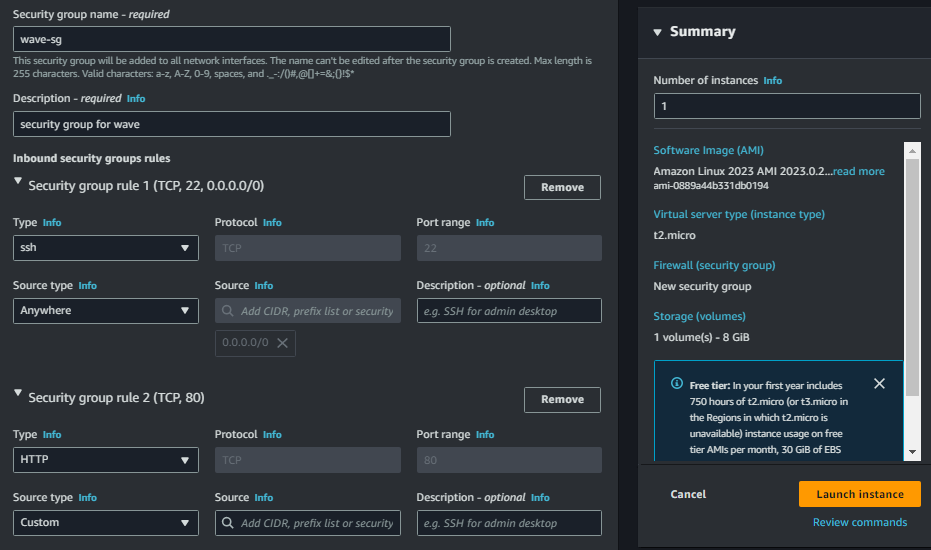

Ssh into EC2 instance with your Ec2 public ip address
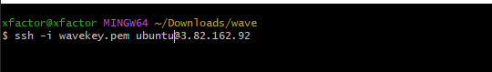


# STEP 1 — Install Apache and PHP

Update package manager and install apache2 and php

```
sudo apt update
sudo apt install apache2 -y
sudo apt install software-properties-common
sudo add-apt-repository ppa:ondrej/php
sudo apt-get install -y php7.3 php7.3-cli php7.3-zip php7.3-json php7.3-common php7.3-mysql php7.3-gd php7.3-mbstring php7.3-curl php7.3-xml php7.3-bcmath php7.3-simple php7.3-intl
```
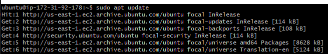

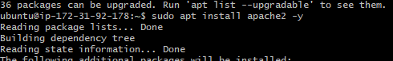


# STEP 2 — Install MYSQL

We would be using amazon RDS to host our database tier.

Create Mysql RDS instance. 
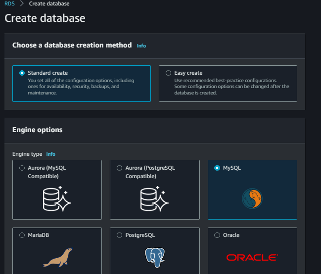

Select free tier 
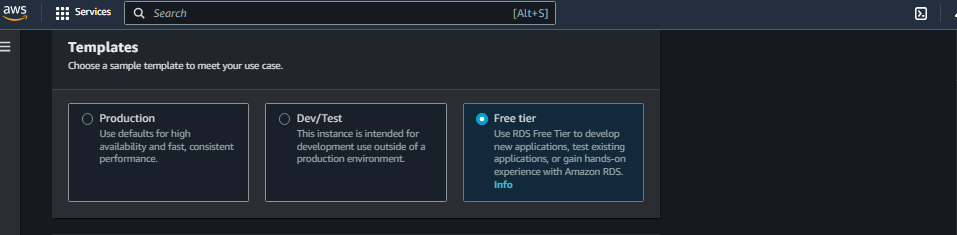

Ensure to save the db name, username, password in a document on your laptop.  It is required to complete prestashop installation.  Reduce storage to 20gb  since free tier is eligible for only 30gb storage

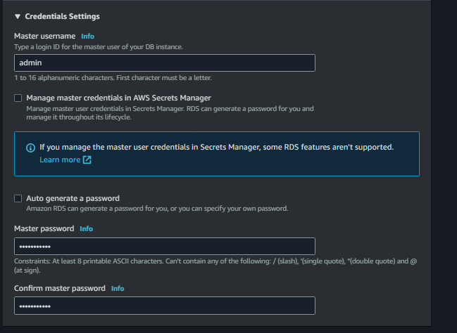

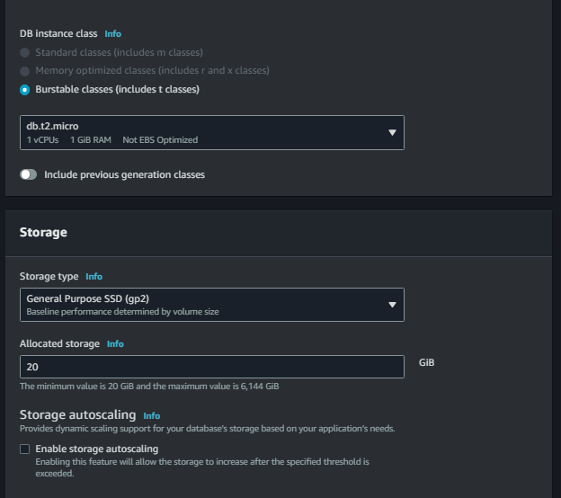

create MYSQL RDS security group to only allow access from Ec2 instance security group

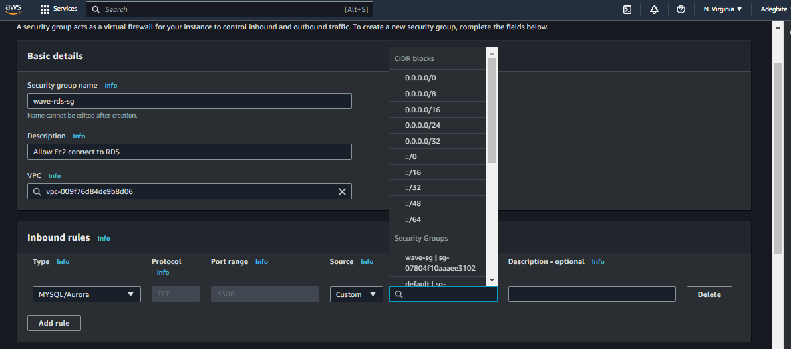

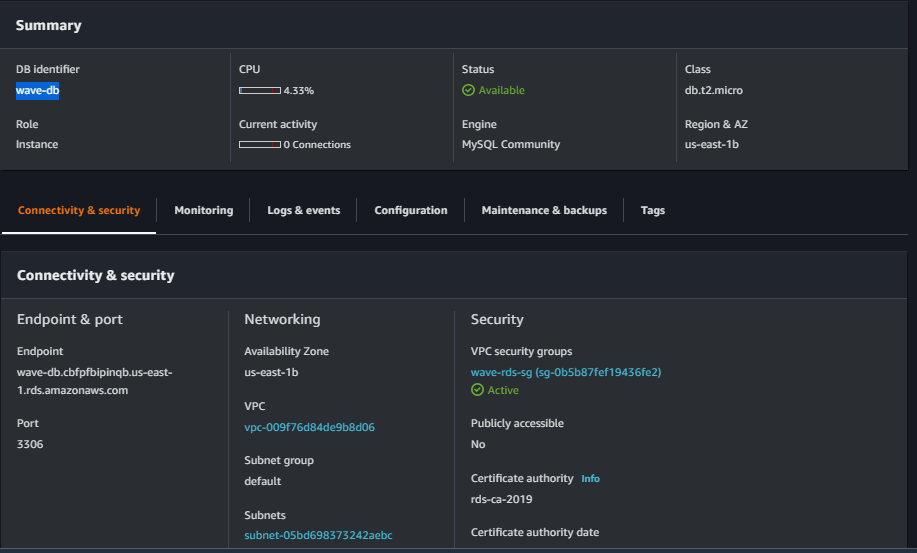


# STEP 2 — Prestashop download and setup.

Change directory and download and unzip prestashop

```
Cd /var/www/
mkdir prestashop
Sudo wget https://assets.prestashop3.com/dst/edition/corporate/8.0.4/prestashop_edition_basic_version_8.0.4.zip
Sudo apt install unzip 
Sudo apt unzip prestashop_edition_basic_version_8.0.4.zip
Sudo apt unzip prestashop.zip
``` 
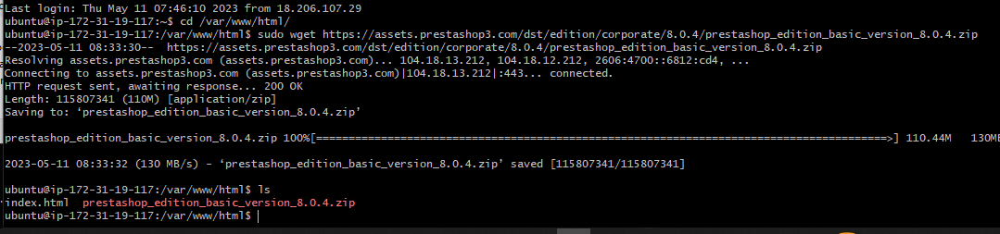

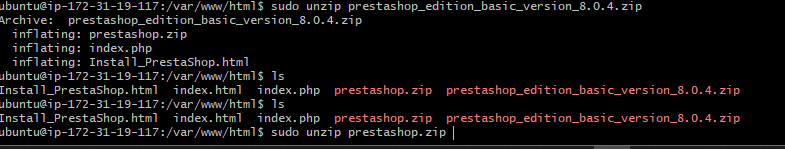

Confirm files extracted from prestashop.zip by running the ls command 

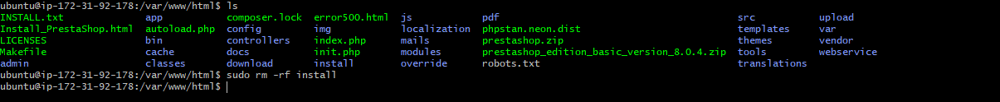

Now we can continue our prestashop install on a web browser with our Ec2 instance public ip address 

Open a web browser of your choice and try to access following url

```
http://<Public-IP-Address>/prestashop
```

Another way to retrieve your Public IP address, other than to check it in AWS Web console, is to use following command:

```
curl -s http://169.254.169.254/latest/meta-data/public-ipv4
```

You should get below page 

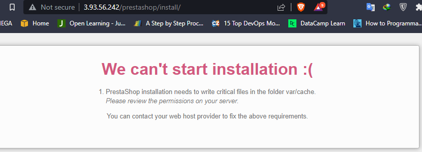

Change folder permission to allow prestashop installation write critical files, Refresh and continue installation, access installation page  with EC2 public ip
```
sudo chown -R www-data:www-data /var/www/prestashop/
sudo chmod -R 755 /var/www/prestashop/
```

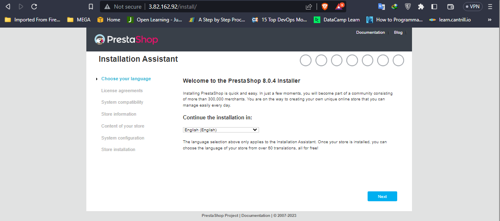


Run below command to fix issue and restart apache service
```
sudo a2enmod rewrite
sudo systemctl restart apache2
```
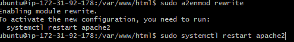

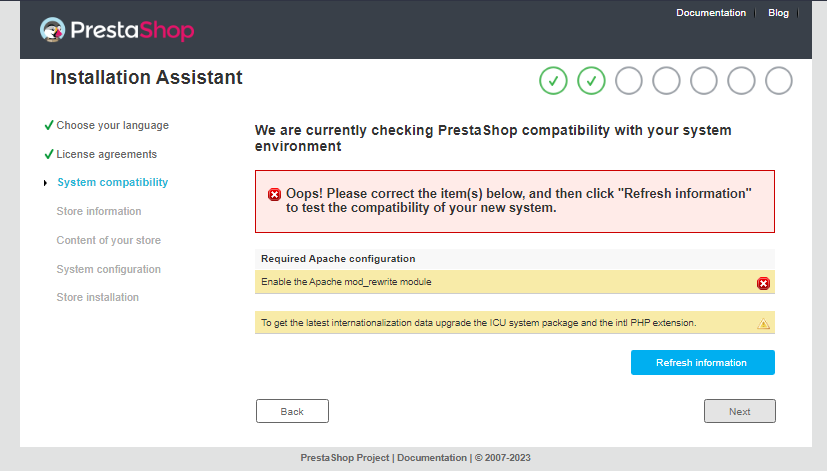

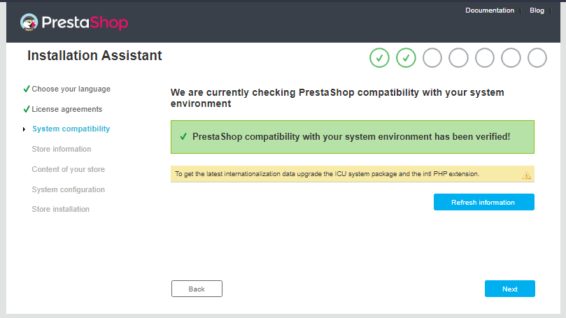

Click next to continue installation

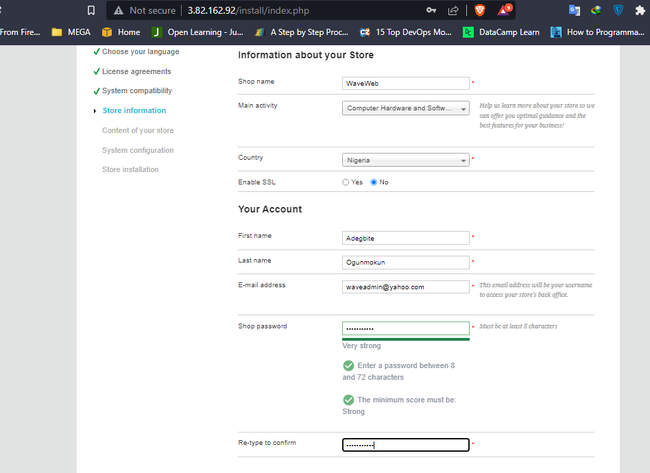

Input Mysql RDS info created earlier amd test database connection


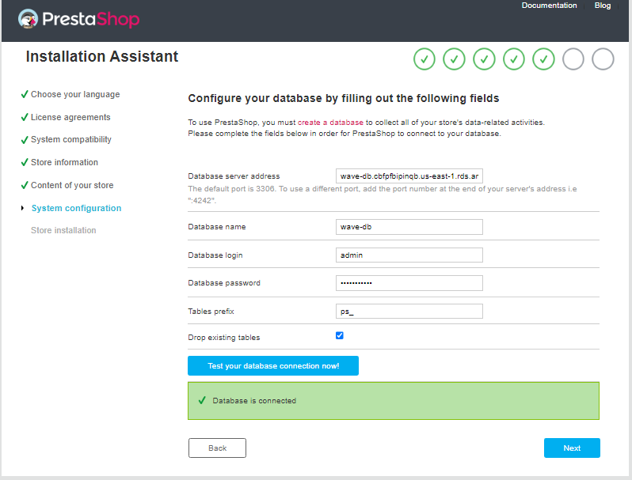

Important: if database connection fails, configure RDS security group to allow access from Ec2 instance security group

Click next to continue installation

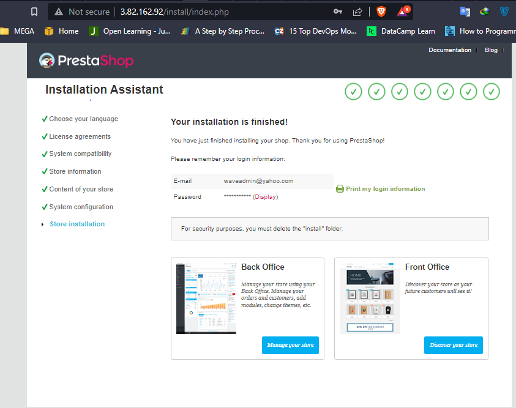

 Delete install folder and this completes prestashop installation with database hosted on AWS RDS

 

Congratulations! your prestashop website is completely installed and fully operational.

# STEP 3 — Enable Website

Logon to backend with your earlier created email address and password 

```
http://<Public-IP-Address>/prestashop/admin
```

Go to shop parameters => Maintenance => Enable store


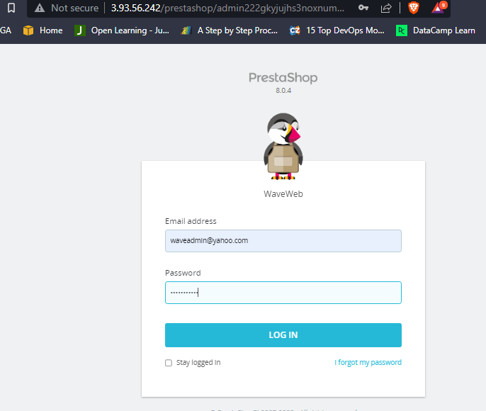

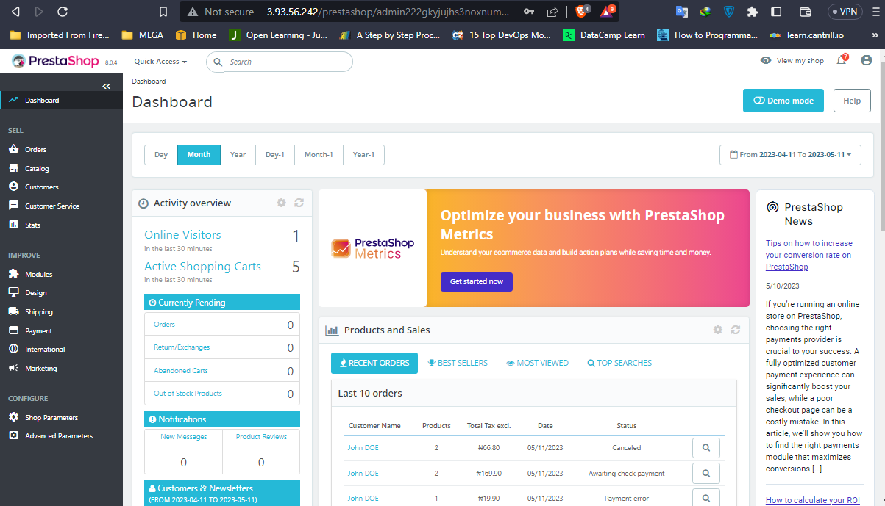

# STEP 4— Simulate account creation and data persistence 


